# 食谱

## 1. 番茄土豆肥牛

### 耗时：30min

### 食材

- 肥牛
- 番茄
- 土豆
- 洋葱
- 葱
- 姜

### 调料

- 生抽
- 盐
- 蚝油
- 料酒

### 步骤

1. 番茄和土豆切块、洋葱切小条
2. 油热倒入洋葱
3. 倒入番茄摁压出汁
4. 加入调料如下：
   - 2勺生抽
   - 1勺盐
   - 1勺蚝油
5. 加清水煮开，下土豆，小火炖20分钟
6. 肥牛冷水下锅加入去腥三件套（葱、姜、料酒），煮熟去掉浮沫捞出
7. 加入肥牛继续炖5分钟
8. 撒葱花出锅

### 视频链接

[番茄土豆肥牛](https://www.bilibili.com/video/BV1GL4y157SZ?spm_id_from=333.1007.top_right_bar_window_history.content.click&vd_source=419a4f4f8393f4836903da680be983dc)

## 2. 番茄肥牛烩饭

### 耗时：10min

### 食材

- 肥牛
- 番茄
- 洋葱
- 葱
- 姜

### 调料

- 生抽
- 老抽
- 蚝油
- 料酒
- 番茄酱
- 白糖
- 淀粉
- 黑胡椒

### 步骤

1. 肥牛冷水下锅加入去腥三件套（葱、姜、料酒），煮熟去掉浮沫捞出
2. 番茄切块、洋葱切小条
3. 准备调料如下：
   - 3勺生抽
   - 半勺老抽
   - 2勺番茄酱
   - 半勺白糖
   - 1勺淀粉
   - 适量黑胡椒
   - 半碗清水
4. 油热倒入洋葱
5. 倒入番茄摁压出汁
6. 倒入料汁和肥牛
7. 倒入米饭拌匀
8. 撒葱花出锅

### 视频链接

[番茄肥牛烩饭](https://www.bilibili.com/video/BV1bF41147Ft?spm_id_from=333.788.top_right_bar_window_history.content.click&vd_source=419a4f4f8393f4836903da680be983dc)

### 成品展示

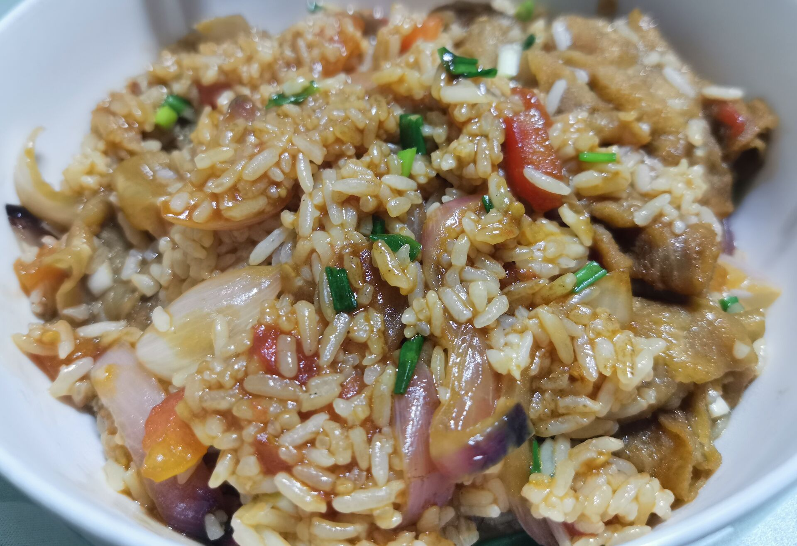

## 3. 芹菜炒肉

### 耗时：5min

### 食材

- 芹菜
- 猪肉
- 姜
- 蒜
- 小米辣

### 调料

- 盐
- 料酒
- 老抽
- 淀粉
- 白糖
- 鸡精

### 步骤

1. 猪肉切条，放入碗中，加入盐，料酒，老抽，搅拌均匀，然后加入干淀粉，搅拌均匀，最后加入植物油
2. 香芹去叶子，洗干净，切段
3. 小米椒切长条和切好的芹菜放一起
4. 切姜丝和蒜丝
5. 热油下肉，炒好后倒出备用
6. 锅里倒姜丝和蒜丝，炒出香味
7. 倒入芹菜和小米辣，炒的过程中可以加一点清水。炒至断生，放盐、白糖、鸡精，再次翻炒均匀
8. 放入肉丝，扒拉几下
9. 出锅

### 视频链接

[芹菜炒肉](https://www.bilibili.com/video/BV1W34y1Z7oZ?spm_id_from=333.1007.top_right_bar_window_history.content.click&vd_source=419a4f4f8393f4836903da680be983dc)

### 成品展示

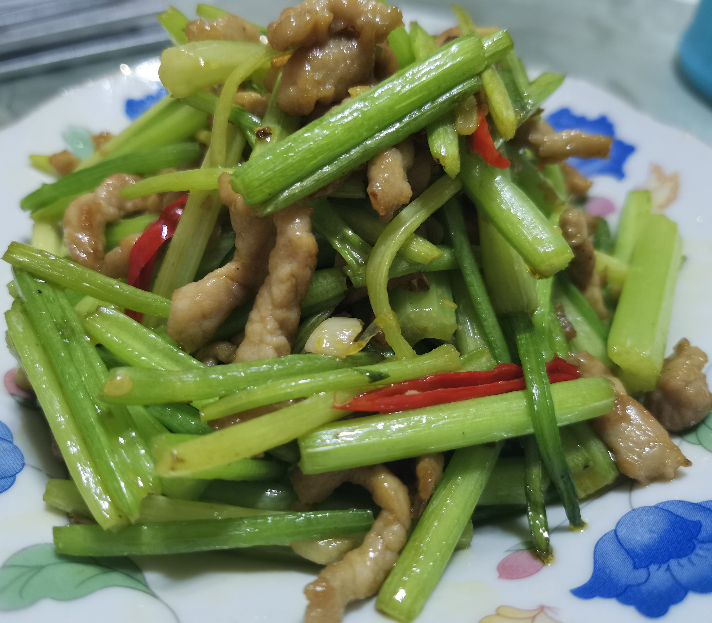

## 4. 肉末土豆茄子

### 耗时：30min

### 食材

- 茄子
- 土豆
- 猪肉
- 青椒
- 红椒

### 调料

- 盐
- 葱
- 姜
- 蒜
- 小米辣
- 豆瓣酱

### 步骤

1. 土豆切段，再切条，加一勺盐腌制15分钟
2. 茄子腌制期间
   1. 土豆削皮，切成小块
   2. 剁肉末
   3. 切好青椒和红椒
   4. 切好葱姜蒜末和小米辣
3. 15分钟后，将茄子挤干水分
4. 准备调料
   - 2勺生抽
   - 半勺老抽
   - 1勺蚝油
   - 1勺料酒
   - 1勺陈醋
   - 1勺糖
5. 油热下葱姜蒜末和小米辣爆香
6. 放猪肉末炒至变色
7. 加一勺豆瓣酱炒出红油
8. 倒入土豆块翻炒1-2分钟
9. 倒入茄子，并且加入刚刚准备的调料，翻炒均匀
10. 加一碗水，加盖煮10分钟
11. 撒上葱花，青红椒，出锅

### 视频链接

[肉末土豆茄子](https://www.bilibili.com/video/BV1Fu411S78s?spm_id_from=333.1007.top_right_bar_window_custom_collection.content.click&vd_source=419a4f4f8393f4836903da680be983dc)

### 成品展示

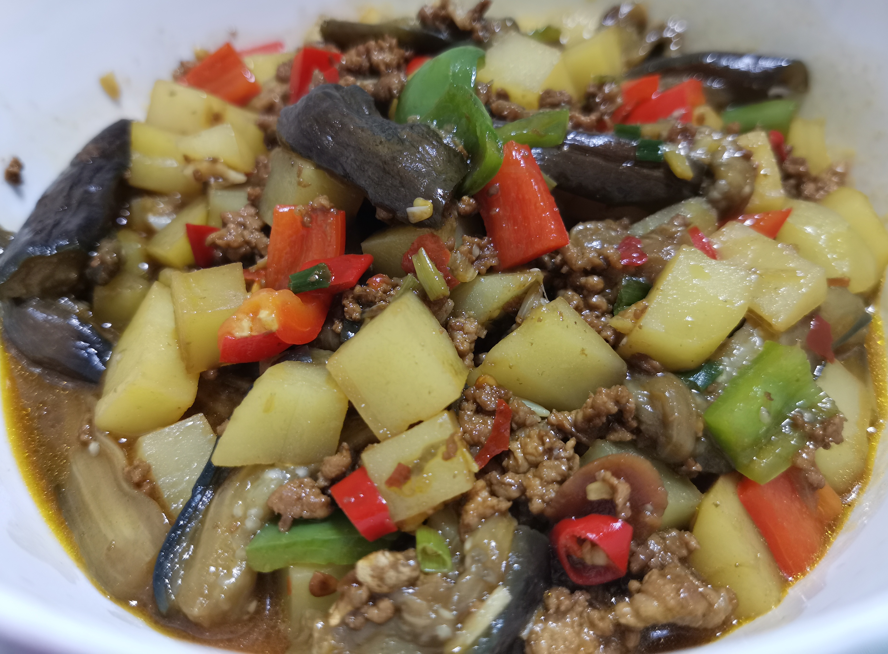

## 5. 青椒豆皮

### 耗时：10min

### 食材

- 青椒
- 豆皮
- 葱
- 蒜

### 调料

- 花椒
- 黄豆酱
- 生抽
- 香油

### 步骤

1. 豆皮切三角块，抖散开
2. 青椒去头去籽，切斜块
3. 葱切成葱花
4. 蒜切片
5. 锅里热油，放入几颗花椒炸香
6. 放入葱蒜炒香
7. 放入一勺黄豆酱或甜面酱炒香
8. 放入青椒，快速翻炒半分钟
9. 再倒入豆皮翻炒均匀
10. 倒入适量生抽，豆皮很好熟，翻炒几下即可
11. 淋入香油，出锅装盘

### 视频链接

[青椒豆皮](https://www.bilibili.com/video/BV1Zs411u7FV?spm_id_from=333.1007.top_right_bar_window_custom_collection.content.click&vd_source=419a4f4f8393f4836903da680be983dc)

### 成品展示

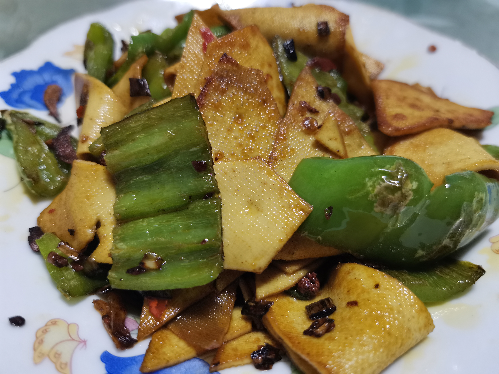

## 6. 番茄煎蛋汤

### 耗时：5min

### 食材

- 番茄
- 鸡蛋
- 葱

### 调料

- 盐
- 胡椒粉
- 生抽
- 香醋

### 步骤

1. 番茄划十字，用开水烫去皮，然后切小块
2. 切葱花
3. 打几个蛋，蛋液里加入少许盐、胡椒粉、葱花，搅拌
4. 热油，下蛋液，小火定型，然后翻面，煎好后放入碗中备用
5. 热油，小葱爆香
6. 加入番茄，炒出汁水
7. 加入一大碗水和煎好的鸡蛋
8. 加调料
   - 生抽
   - 香醋
   - 盐
   - 胡椒粉
9. 水开后，撒上葱花，起锅

### 成品展示

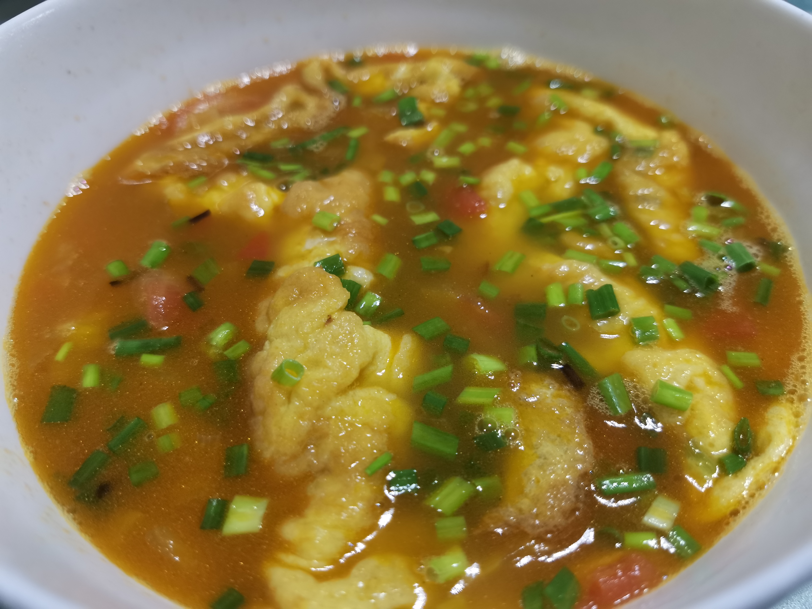

## 7. 红椒炒肉

### 耗时：10min

### 食材

- 红椒
- 猪肉

### 调料

- 生抽
- 料酒
- 盐
- 淀粉
- 糖

### 步骤

1. 猪肉切丝
2. 猪肉加入调料腌制
   - 生抽
   - 料酒
   - 盐
   - 糖
   - 淀粉
3. 红椒切丝
4. 热油下肉丝，炒至变白，倒出备用
5. 热油下红椒丝，炒至断生
6. 倒入肉丝
7. 加入调料
   1. 生抽
   2. 盐
8. 出锅

### 视频链接

[红椒炒肉](https://www.bilibili.com/video/BV1Qx411r74v?spm_id_from=333.1007.top_right_bar_window_custom_collection.content.click&vd_source=419a4f4f8393f4836903da680be983dc)

### 成品展示

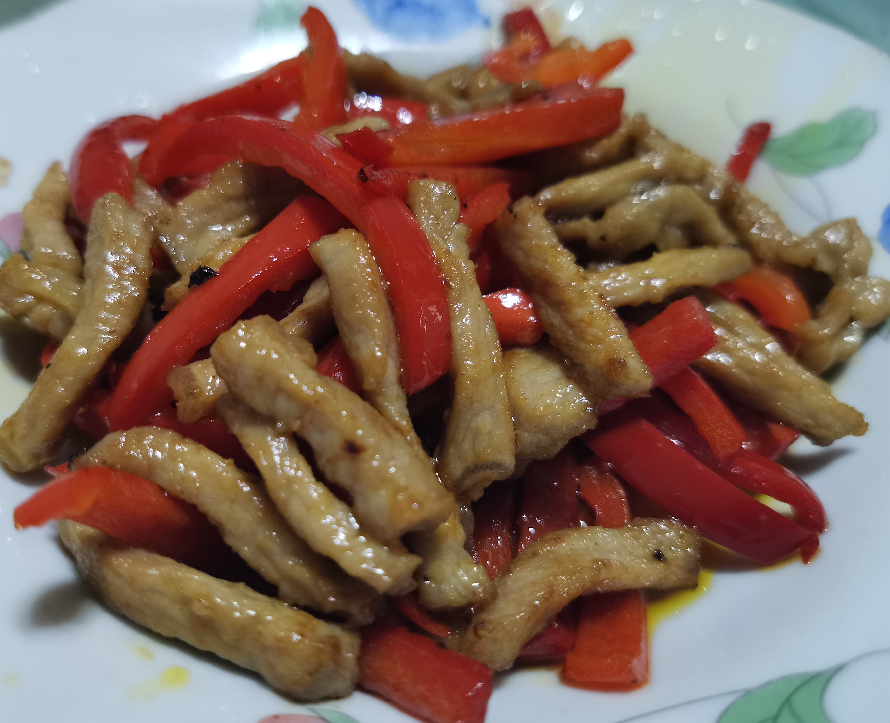

## 8. 洋葱炒肉

### 耗时：10min

### 食材

- 洋葱
- 猪肉
- 姜
- 鸡蛋

### 调料

- 盐
- 胡椒粉
- 料酒
- 淀粉
- 生抽
- 老抽
- 香醋

### 步骤

1. 洋葱顶部改米字花刀，然后清水里侵泡5分钟，避免辣眼睛
2. 洋葱泡好后，底部改米字花刀，然后侧面切开成小块
3. 肉切片
4. 开始腌制肉
   - 盐
   - 胡椒粉
   - 料酒
   - 半个蛋清
   - 淀粉
   - 植物油
5. 切好姜丝
6. 锅烧热，倒油，放入姜丝爆香
7. 放入肉，肉炒至变白以后，来少许料酒
8. 放入洋葱，少许生抽，大火翻炒均匀
9.  来一点老抽
10. 洋葱变色以后，放入适量的盐，一点香醋从锅边淋入
11. 翻炒均匀后，起锅装盘

### 视频链接

[洋葱炒肉](https://www.bilibili.com/video/BV1QV41127ES?spm_id_from=333.337.search-card.all.click&vd_source=419a4f4f8393f4836903da680be983dc)

### 成品展示

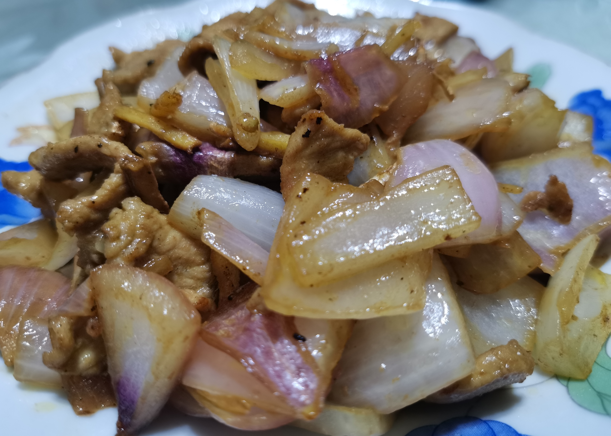

## 9. 蒜苔炒肉

### 耗时：10min

### 食材

- 猪肉
- 蒜苔
- 葱花

### 调料

- 盐
- 料酒
- 水淀粉
- 生抽
- 老抽
- 鸡精

### 步骤

1. 猪肉切丝
2. 猪肉腌制十分钟
   - 盐
   - 料酒
   - 水淀粉
3. 蒜苔切段
4. 切一点葱花
5. 热锅凉油，油温三成热，下猪肉，变白后捞出备用
6. 锅里留底油，直接放入蒜苔煸炒一分钟左右
7. 蒜苔变软后放入葱花，炒出香味
8. 放肉丝，加入生抽翻炒一下
9. 加入老抽，翻炒
10. 加入盐和鸡精
11. 加一点清水，翻炒一下
12. 出锅

### 视频链接

[蒜苔炒肉](https://www.bilibili.com/video/BV1S64y1o7zx?spm_id_from=333.1007.top_right_bar_window_history.content.click&vd_source=419a4f4f8393f4836903da680be983dc)

### 成品展示

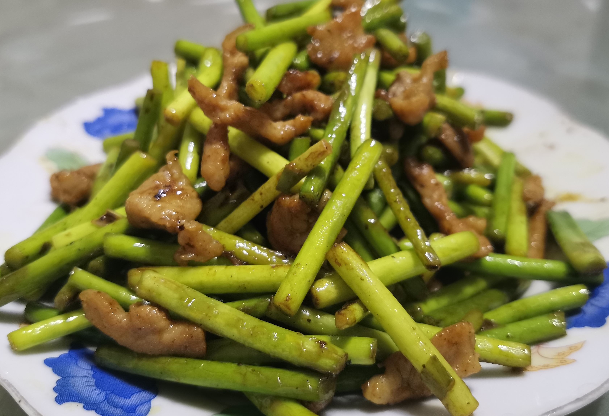

## 10. 茄子焖饭

### 耗时：30min

### 食材

- 茄子
- 米
- 葱

### 调料

- 生抽
- 米醋
- 白芝麻
- 辣椒粉

### 步骤

1. 茄子中间划一刀，然后切半圆
2. 油烧热1分钟，倒入茄子炒1-2分钟
3. 放入3勺生抽
4. 茄子变软后出锅备用
5. 电饭煲里大米和清水，正常煮饭的量，然后倒入茄子
6. 直接煮就完事儿了
7. 调一碗酱汁
   - 2勺生抽
   - 半勺米醋
   - 葱花
   - 白芝麻
   - 辣椒粉
8. 煮好了撒上葱花

### 视频链接

[茄子焖饭 3: 45](https://www.bilibili.com/video/BV16u411Z7Pj?spm_id_from=333.999.0.0&vd_source=419a4f4f8393f4836903da680be983dc)

### 成品展示

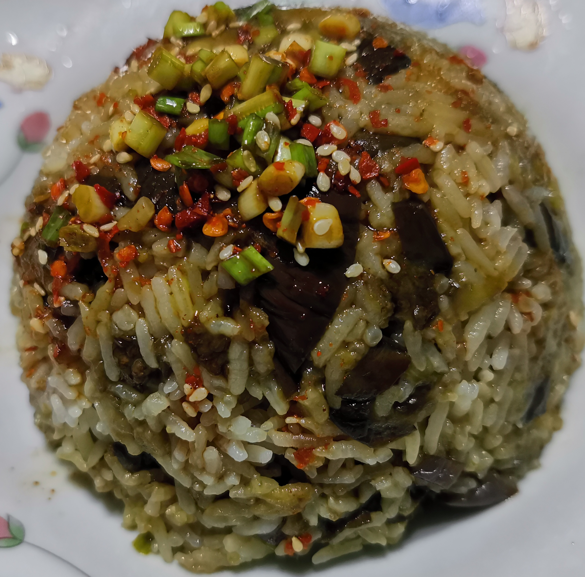

## 11. 莴笋炒肉

### 耗时：15min

### 食材

- 莴笋
- 肉
- 鸡蛋
- 葱
- 姜
- 蒜
- 小米辣

### 调料

- 盐
- 胡椒粉
- 生抽
- 淀粉
- 料酒
- 味精

### 步骤

1. 莴笋去皮，去狠一点，斜刀切成小段，然后立起来切片，硬币厚度
2. 将笋片放入碗中，加入一些盐腌制十分钟
3. 肉切片
4. 腌制肉
   - 盐
   - 胡椒粉
   - 生抽
   - 蛋清
5. 抓匀后，放入淀粉再次抓匀，然后放入少许植物油
6. 切姜片，蒜片，葱花，小米辣
7. 莴笋腌制十分钟后，用清水清洗，然后挤干水分
8. 油热后，放入肉片
9. 肉片变白以后，放入葱姜蒜小米辣，继续开中火，将小料炒出香味
10. 锅边淋入料酒、少许生抽
11. 放入笋片，大火翻炒一分钟
12. 笋片炒至断生后，放入盐和味精
13. 炒好之后起锅

### 视频链接

[莴笋炒肉](https://www.bilibili.com/video/BV1d3411H7G5?spm_id_from=333.337.search-card.all.click&vd_source=419a4f4f8393f4836903da680be983dc)

### 成品展示

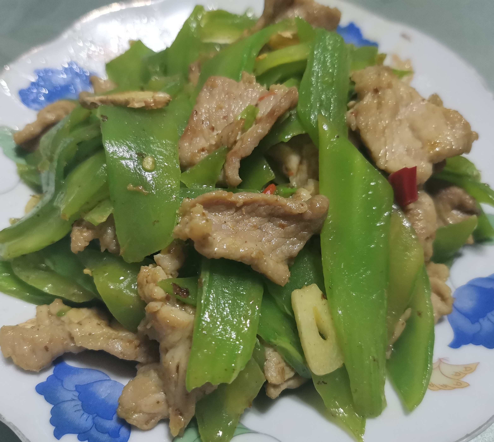

## 12. 肉末土豆

### 耗时：40min

### 食材

- 土豆
- 红椒
- 青椒
- 肉
- 葱
- 蒜

### 调料

- 豆瓣酱
- 料酒
- 盐

### 步骤

1. 土豆切小块，洗去淀粉
2. 猪肉切成肉末
3. 葱切葱花
4. 蒜切蒜末
5. 准备好调料
   - 一勺生抽
   - 半勺老抽
   - 一勺蚝油
   - 少许盐
   - 一勺白糖
   - 半碗清水
6. 油热炒香葱蒜末
7. 倒入肉末炒散
8. 加一勺料酒和一勺豆瓣酱
9. 加入土豆翻炒均匀
10. 加入刚刚调好的料汁
11. 小火加盖煮5分钟
12. 在这5分钟期间切好青椒和红椒，切小块
13. 5分钟后，加入青红椒，淀粉水
14. 收浓汤汁
15. 出锅

### 视频链接

[肉末土豆](https://www.bilibili.com/video/BV1ZS4y127wm?spm_id_from=333.999.0.0&vd_source=419a4f4f8393f4836903da680be983dc)

### 成品展示

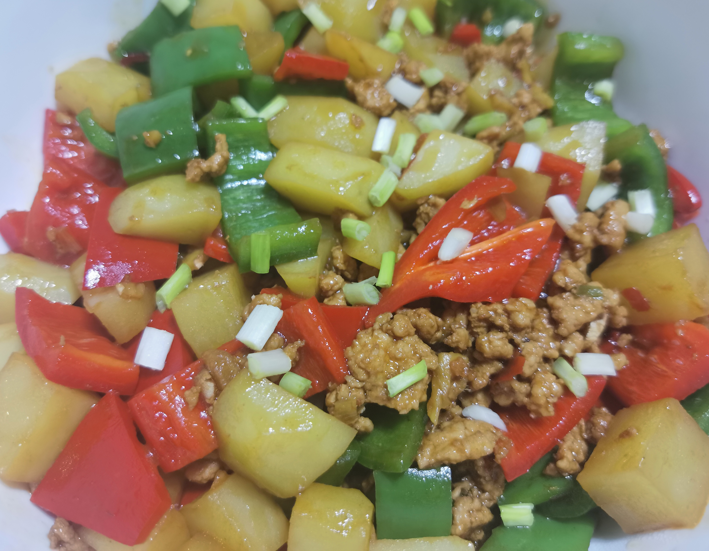

## 13. 茄夹肉末

### 耗时：40min

### 食材

- 茄子
- 五花肉
- 红椒
- 青椒
- 小葱
- 大葱
- 姜

### 调料

- 盐
- 鸡精
- 胡椒粉
- 生抽
- 香油
- 葱姜水
- 蒸鱼豉油

### 步骤

1. 将五花肉剁成肉末，放入碗中
2. 姜切成末，放入碗中
3. 大葱白切葱花，放入碗中
4. 碗中开始调味
   - 盐
   - 鸡精
   - 胡椒粉
   - 生抽
5. 碗中的东西抓拌均匀，抓匀后，朝一个方向搅
6. 加入葱姜水，继续搅拌
7. 加入香油，继续搅拌
8. 茄子切片，第一刀不切断，第二刀切断
9. 将肉末放入茄夹里
10. 蒸锅水烧开，放入茄夹，加盖蒸十分钟
11. 蒸的过程中，适量的青椒切丝，再切成丁
12. 适量的红椒切丝，再切成丁
13. 小葱切葱花
14. 看着时间，可以提前烧热一点油
15. 蒸好后，倒出汤汁，表面加蒸鱼豉油，撒上青红椒丁撒上葱花，然后浇上热油

### 视频链接

[茄夹肉末](https://www.bilibili.com/video/BV1tS4y1i7a7?spm_id_from=333.1007.top_right_bar_window_history.content.click&vd_source=419a4f4f8393f4836903da680be983dc)

### 成品展示

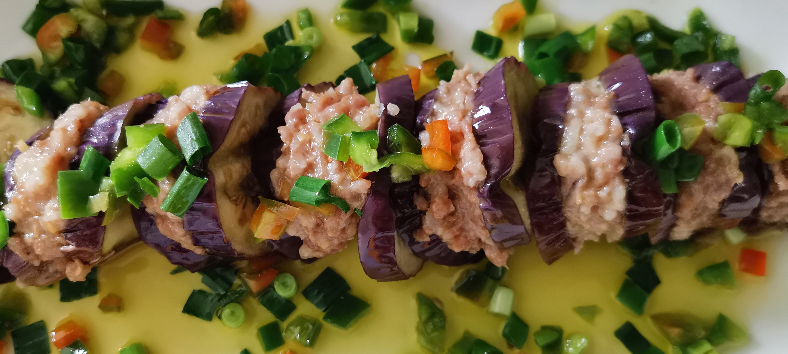